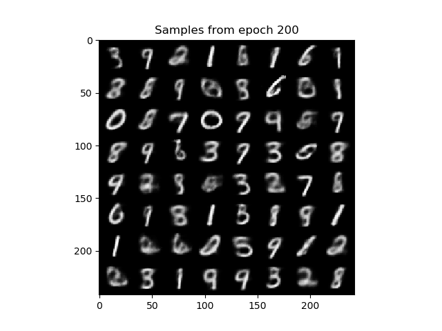
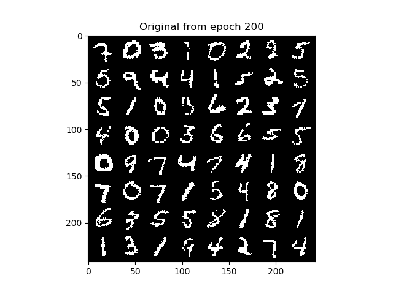
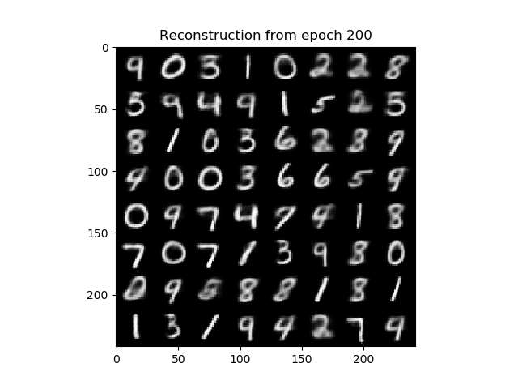
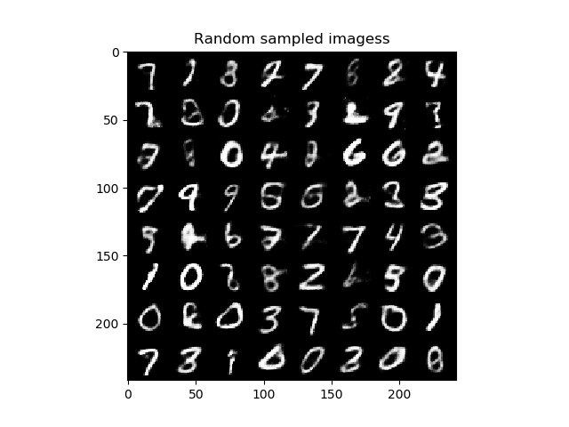
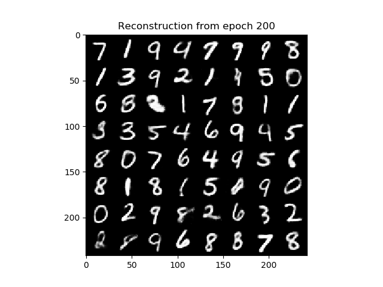

## Variational Autoencoders

Personal implementation of the paper *"AutoEncoding Variational Bayes" by Kingma, D. P., & Welling, M. (2013)*. 
The main purpose of this repository is to make the paper implementation accessible and clear to people
that just started getting into Variational Autoencoders without having to look into highly optimized and difficult to 
search libraries.

I trained my model with the hyperparameters given in the original paper. The latent dimension is 3 and the MLP of 
both the encoder and the decoder has only a single linear layer with 400 hidden units. Increasing the number of layers and
the dimension of the latent space give better results.

We get a log-likelihood on the test -set, computed using 100 importance-weighted samples of -122.4084.

### Samples from the prior p(z) after 200 epochs, z_dim = 3, MLP with one layer (400 units)

### Reconstruction examples after 200 epochs, z_dim = 3, MLP with one layer (400 units)

Increasing the number of hidden layers and the dimension of the latent space, give us better results. I consider the case 
where all MLPs have two hidden layer of 256 and 128 units respectively and a latent space of dimension 12. We get a log-likelihood
on the test set of -92.0768.

### Samples from the prior p(z) after 200 epochs, z_dim = 12, MLP with two layer (256,128 units)

### Reconstruction examples after 200 epochs, z_dim = 12, MLP with two layer (256,128 units)

TODO: this is far from being a complete repo. There are some changes I am still want
make during my free time:
1. train until convergence using a GPU
2. create more functions to avoid repeated code
3. print more infos during training
4. using another dataset other than MNIST
5. add argparse